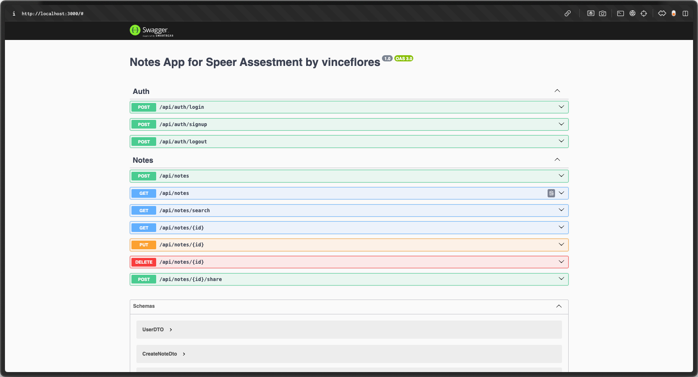

# notes_backend_for_speer

# Demo and Documentation

1. Deployment on Render: [here](https://notes-backend-for-speer.onrender.com)
2. Documentation on Postman: [here](https://documenter.getpostman.com/view/28402561/2sAYQZJY3Y)
3. Simple Swggaer docs: [here](https://notes-backend-for-speer.onrender.com)


# Overview

A notes app, that allows users to create, read, update, and delete Notes.

> ### Note: Api might take a minuite on first request because of Render.com winding down the deployment as it is on the free tier.  



# Project Specification

### Endpoints

# Tech Stack

1. [ Nestjs ](https://docs.nestjs.com/)
2. [ Prisma ](https://www.prisma.io/docs/orm) and PostgresQl:
   - Prisma ORM because of its type safe models to reduce th need of database repository implementation and prevent SQL injection.
3. [ Render ](https://render.com/):
   - for hosting database and containerized app
4. [ Passportjs ](https://www.passportjs.org/docs/) for authentication and autherization:
   - Strategy local for authentication and passport-bearer for authorization

# Plan

Implement a backend applicaiton for a notes app using best practices such as TDD (Test Driven Development)

- [ ] Setup API skeleton
- [ ] Setup initial database schema
- [ ] Implement and test initial API without authentication
- [ ] Introduce Logging
- [ ] Configure Swagger
- [ ] Setup authentication and authorization with Passport.js
- [ ] Setup rate limiting
- [ ] Tests
- [ ] Rate Limiting
- [ ] Final Deployment

# Installation / Setup

After cloning the repository,

```
cd notes_api yarn install
```

Copy secrets

```
#notes_api
cp env-example .env
```

# Usage

Perform migrations for db

```
yarn prisma migrate dev --name='init'
```

```
# . notes_api
yarn prisma generate
yarn run start:dev
```

# Possible Improvements

1. Class Validation
